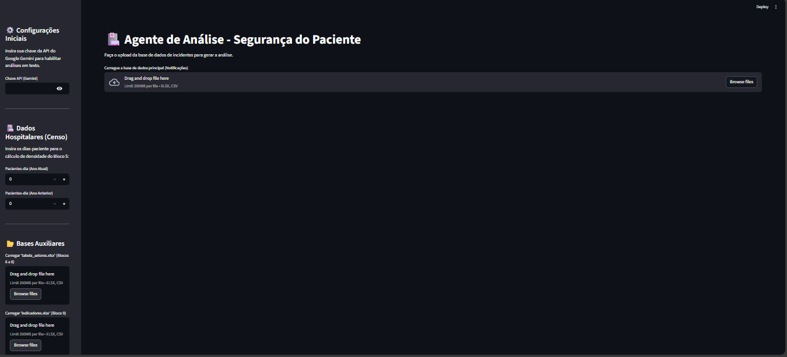
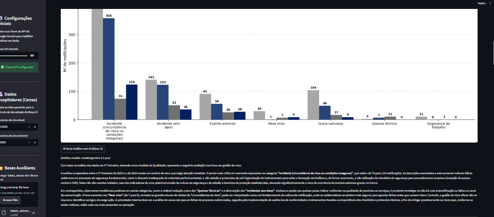

# 🏥 Agente de Inteligência Assistencial  
### Automação de Relatórios de Segurança do Paciente com Python + NLP

---

## 📌 Contexto

Este projeto foi desenvolvido para otimizar a elaboração do **Relatório Trimestral de Segurança do Paciente** em unidade hospitalar.

Antes da implementação, o processo envolvia:

- Consolidação manual de múltiplas planilhas  
- Cruzamentos estatísticos  
- Construção manual de gráficos  
- Redação técnica interpretativa  
- Revisões sucessivas  

O ciclo completo levava, em média, cerca de **30 dias de trabalho para elaborar o relatório do trimestre**.

---

## 🎯 Objetivo

Reduzir drasticamente o tempo operacional e aumentar:

- 📊 Consistência estatística  
- 🔎 Padronização das análises  
- 📈 Confiabilidade dos indicadores  
- ⚡ Agilidade na tomada de decisão  

---

## 🚀 Resultado Obtido

Com o Agente de Inteligência Assistencial:

- O relatório passou a ser gerado em aproximadamente **5 minutos**
- A análise textual passou a ser **gerada automaticamente**
- A interpretação considera **variações estatísticas e tendências históricas**
- O processo tornou-se replicável e menos dependente de esforço manual

Importante:  
O sistema **não substitui a análise humana**, mas automatiza a etapa operacional e gera um diagnóstico técnico estruturado para validação final.

---

## 🖥️ Interface do Sistema

### Tela Inicial
Upload das bases e configuração dos parâmetros:



---

### Exemplo de Análise Gerada
Gráficos comparativos + interpretação textual automática com IA:



---

## 🧠 Como Funciona

O sistema executa:

1. Ingestão de dados (Excel/CSV)
2. Tratamento e padronização via **Pandas**
3. Cálculo de indicadores estatísticos
4. Geração de gráficos com **Matplotlib**
5. Processamento textual via **Google Gemini API**
6. Consolidação em relatório estruturado na interface

---

## 🏗️ Arquitetura

```bash
├── app.py                # Interface Streamlit
├── motor_analise.py      # Regras de negócio e cálculos
├── tela_inicial.png      # Screenshot inicial
├── analise_gerada.png    # Screenshot com análise
└── Ligar_Painel.bat      # Script para iniciar o servidor
```

## 🔄 Fluxo Simplificado

```text
Usuário
   ↓
Servidor Streamlit (execução centralizada)
   ↓
Motor de Análise (Pandas + Estatística)
   ↓
Gemini API (NLP)
   ↓
Relatório Executivo
```

## 🔐 Segurança e Governança

- O sistema é executado de forma centralizada dentro da rede interna.
- Nenhum dado sensível é armazenado externamente.
- A chave da API é inserida no momento da execução.
- A arquitetura prioriza controle interno e governança dos dados.

---

## ▶️ Execução

Para iniciar o sistema:

1. Execute o arquivo:

```bash
Ligar_Painel.bat
```
2. O servidor Streamlit será iniciado na máquina host.

3. Usuários da rede interna podem acessar via IP + porta configurada.

---

## 🛠️ Tecnologias Utilizadas

- Python 3
- Streamlit
- Pandas
- Matplotlib
- Google Gemini API (NLP)

---

## 📊 Estrutura Analítica do Relatório

O relatório é composto por 11 blocos:

1. Visão Geral
2. Histórico Temporal (5 anos)
3. Classificação de Incidentes
4. Análise por Turno
5. Gravidade e Taxonomia
6. Setores Assistenciais
7. Setores Administrativos
8. Setores de Apoio
9. Indicadores de Qualidade
10. Tratativas e Protocolos
11. Matriz de Risco (incluindo HFMEA/Ishikawa)

---

## 📌 Considerações Finais

Este projeto representa a convergência entre:

- Engenharia de Dados
- Estatística Aplicada
- Business Analytics
- IA Generativa

Mais do que um dashboard, trata-se de um sistema de automação analítica aplicado a um problema real em ambiente produtivo.

---

Desenvolvido por **Ediney Magalhães**  
*Analytics Engineer | Estatística Aplicada | Health Analytics*


