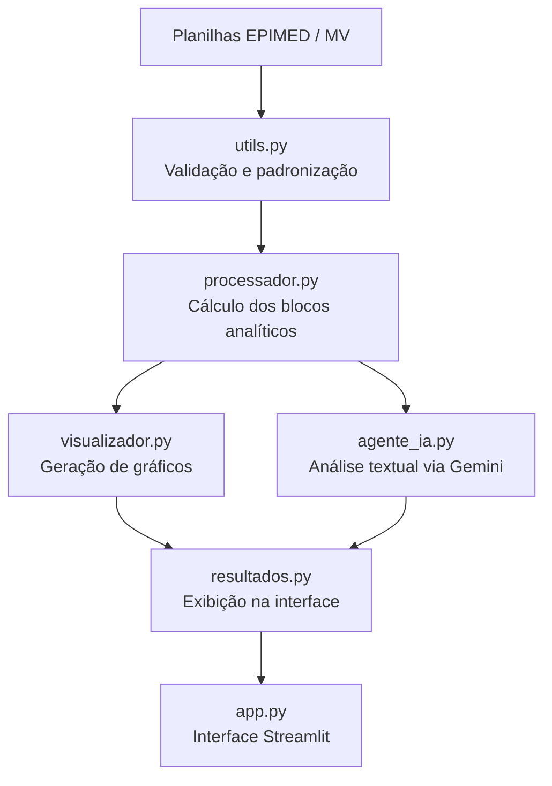

# Agente de Inteligência Assistencial

Sistema de automação para elaboração do Relatório Trimestral de Segurança do 
Paciente em ambiente hospitalar, desenvolvido com Python e IA generativa.

---

## Contexto

A elaboração do relatório trimestral envolvia consolidação manual de múltiplas planilhas, cruzamentos estatísticos, construção de gráficos e redação técnica interpretativa. O ciclo completo consumia aproximadamente 30 dias de trabalho.

---

## Solução

O sistema automatiza o pipeline completo de dados — da ingestão à análise — estruturado em módulos especializados e alinhado ao modelo institucional de relatório de segurança do paciente.

O sistema não substitui a análise humana. Ele automatiza a etapa operacional e entrega diagnóstico técnico estruturado para validação e decisão.

---

## Impacto

- Geração dos outputs em aproximadamente 5 minutos
- Consolidação e conclusão do relatório em 2 a 3 horas
- Redução de aproximadamente 30 dias para menos de um dia de trabalho
- Análise padronizada e replicável a cada trimestre

---

## Arquitetura

```mermaid
flowchart TD
    A[Planilhas EPIMED / MV] --> B[utils.py\nValidação e padronização]
    B --> C[processador.py\nCálculo dos blocos analíticos]
    C --> D[visualizador.py\nGeração de gráficos]
    C --> E[agente_ia.py\nAnálise textual via Gemini]
    D --> F[resultados.py\nExibição na interface]
    E --> F
    F --> G[app.py\nInterface Streamlit]
```

## Fluxo de Dados

1. Usuário exporta as planilhas do sistema MV e carrega na interface
2. O sistema valida, padroniza e processa os dados por bloco analítico
3. Gráficos e tabelas são gerados automaticamente
4. O profissional aciona a análise de IA por seção sob demanda
5. Os outputs subsidiam a consolidação do relatório oficial

## Blocos Analíticos

O sistema cobre 10 seções do modelo institucional de relatório:

| Seção | Conteúdo |
|-------|----------|
| Gráfico 1 | Volume de notificações — comparativo trimestral e anual |
| Gráfico 2 | Distribuição por turno com análise textual |
| Gráfico 3 | Classificação das notificações com top 3 por categoria |
| Gráfico 4 | Eventos adversos — top 3, grau do dano e investigações |
| Gráfico 5 | Setores notificantes — top 3 com análise |
| Gráfico 6 | Setores notificados — top 3 com análise |
| Gráfico 7 | Índices de qualidade — erro de medicação, LPP, flebite e queda |
| Gráfico 8 | Cumprimento de análise de notificações |
| Seção 5 | Protocolos gerenciados — AVC, Dor Torácica, Sepse, TEV |
| Seção 10 | Interrelação e mapeamento de risco institucional |

---

## Segurança e Governança

O sistema opera exclusivamente na rede interna hospitalar. Nenhum dado trafega para servidores externos. A decisão de manter execução local foi tomada em conformidade com os requisitos da LGPD para dados sensíveis de saúde.

---

## Execução

```bash
Ligar_Painel.bat
```

O servidor Streamlit é iniciado localmente. Usuários da rede interna acessam 
via IP + porta configurada.

---

## Tecnologias

- Python 3 — Pandas, Matplotlib, Streamlit
- Google Gemini API — análise textual e triagem por IA
- python-dotenv — gestão segura de credenciais

---

## Documentação Técnica

Decisões de arquitetura, justificativas e histórico de mudanças estão 
registrados em `docs/`.

---

### Desenvolvido por Ediney Magalhães
### Analytics Engineer | Estatístico| Data Engineer